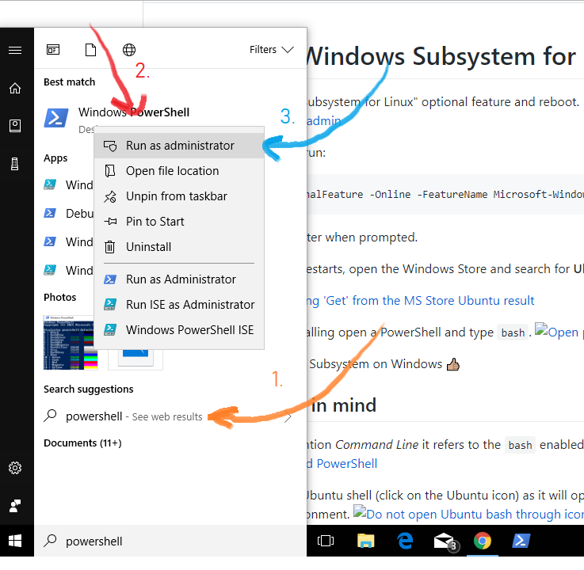
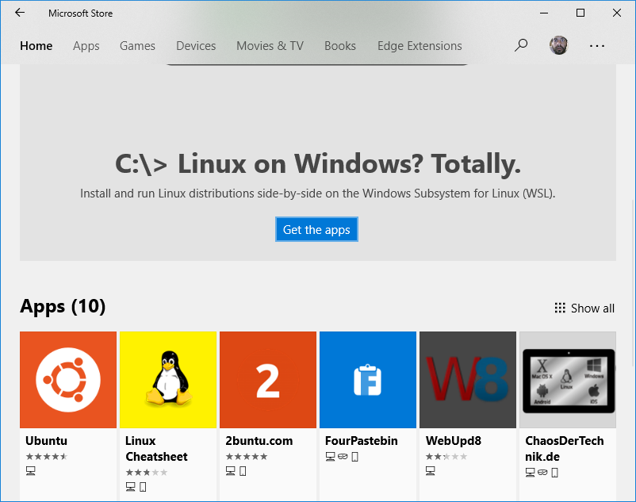
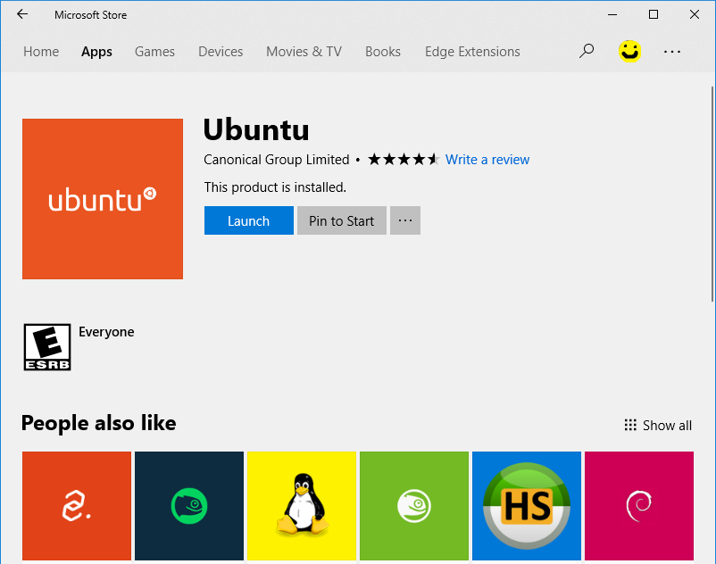
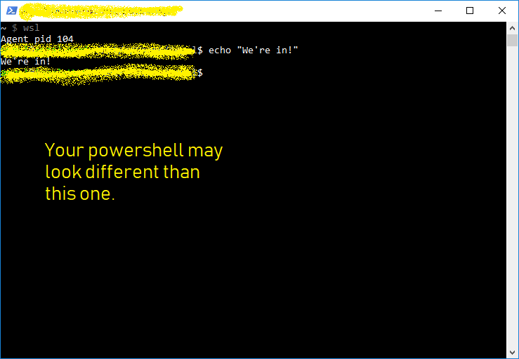
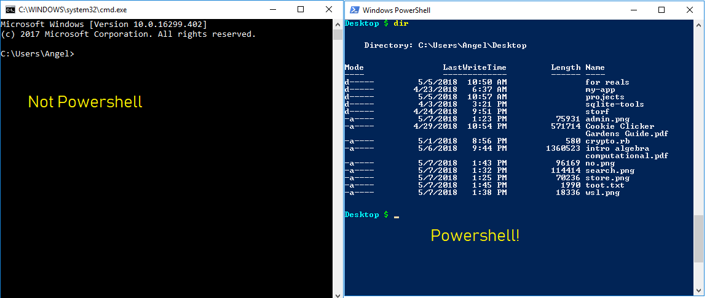
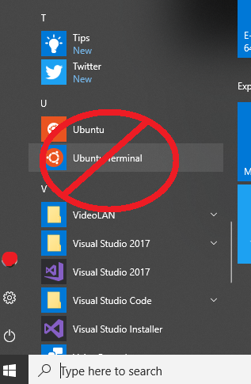

# Install the Windows Subsystem for Linux
Enable the "Windows Subsystem for Linux" optional feature and reboot.
1.- Open PowerShell as Administrator:
    
    
2.- In your PowerShell run: 

```shell
Enable-WindowsOptionalFeature -Online -FeatureName Microsoft-Windows-Subsystem-Linux
```
    
3.- Restart your computer when prompted.

4.- Once your System restarts, open the Windows Store and search for **Ubuntu**.
    
    
5.- Select _Get_
    
    
6.- When it's done installing open a PowerShell and type `wsl`.
    

Voilà! You have a Linux Subsystem on Windows 👍🏼

## Things to keep in mind
- Every time we mention _Command Line_ it refers to the `bash` enabled PowerShell.
    

- **Do not** open the Ubuntu shell (click on the Ubuntu icon) as it will open a Command Line located in a different folder than your current environment.
    


